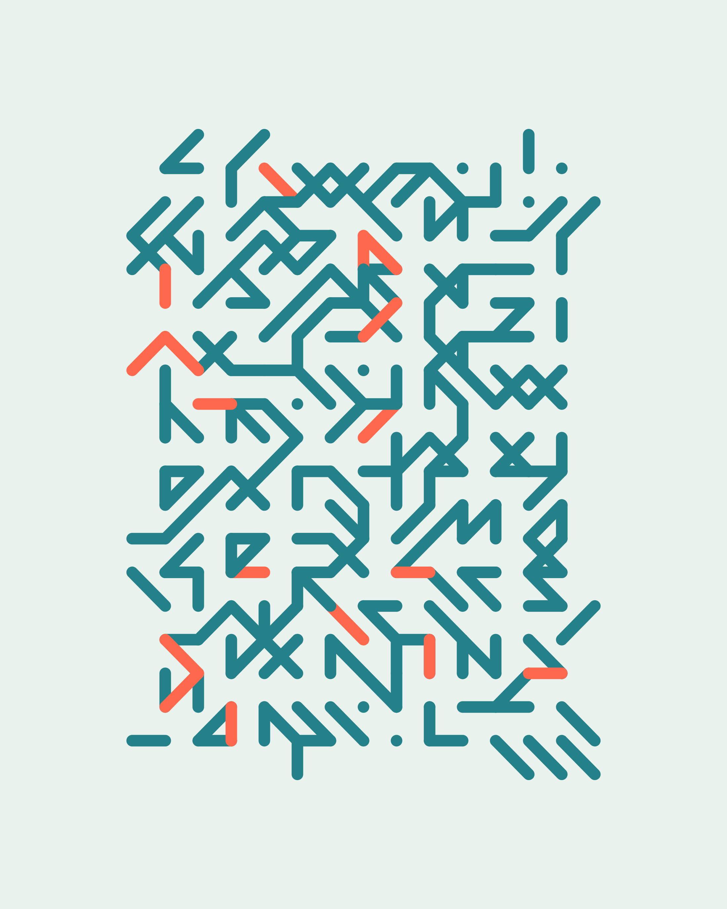
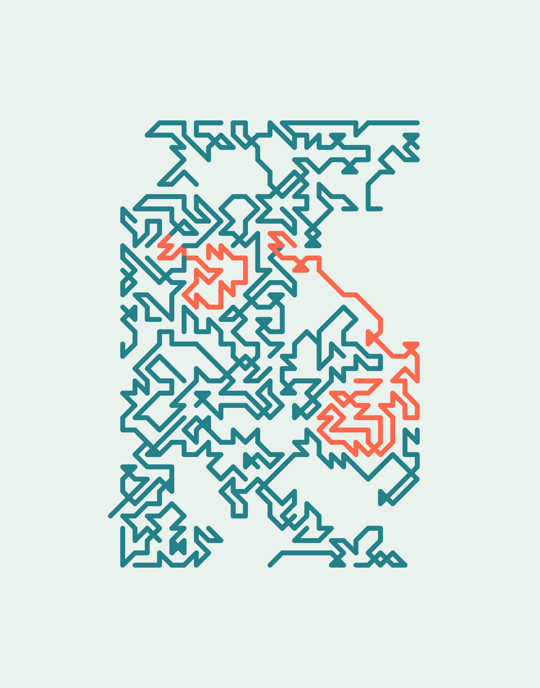
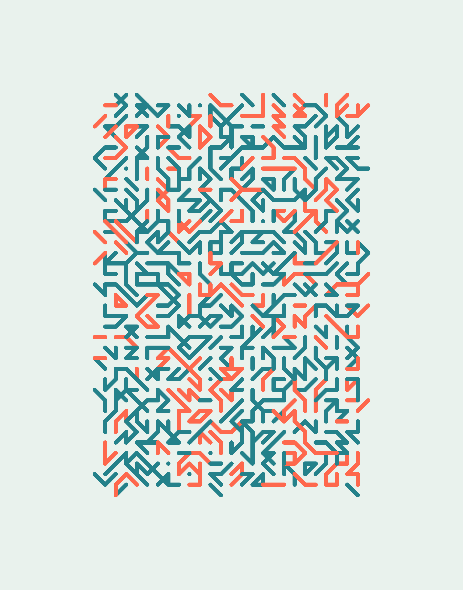

[Try the live version](https://play.generativemistakes.art/boozy)

## In a nutshell

1.

- Create equally spaced squares along the vertical line `x = stripe.middle.x` of
  each stripe.
  - Use the probabilistic function `squareColor = f()` to determine the color of
    the square.
  - If the square is inside a black stripe, draw it.
  - If the square is outside a black stripe,
    - Use the probability `drawSquare = f(y)` that is lower the further away
      from `canvas.middle.y`, to determine if the square is drawn or not.
    - Draw it using an opacity value `alpha = f(y)` that is lower the further
      away from `canvas.middle.y`.

---

This project is open source. If you want to experiment with it, you can
[get the code](https://github.com/davidomarf/generative-mistakes/blob/master/sketches/boozy/sketch.js).

To generate different works with the same configuration of the final result, but
with different noise seeds,
[try the live version](https://play.generativemistakes.art/boozy)
