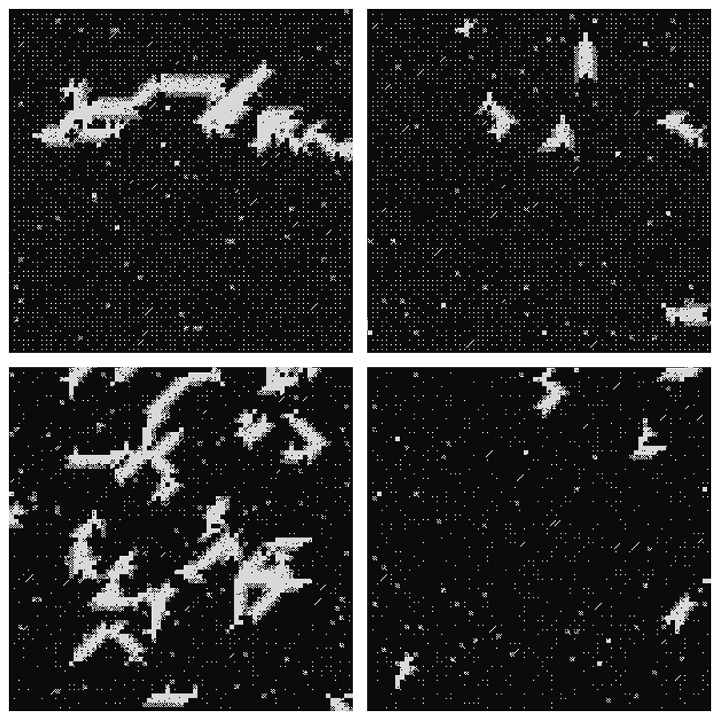
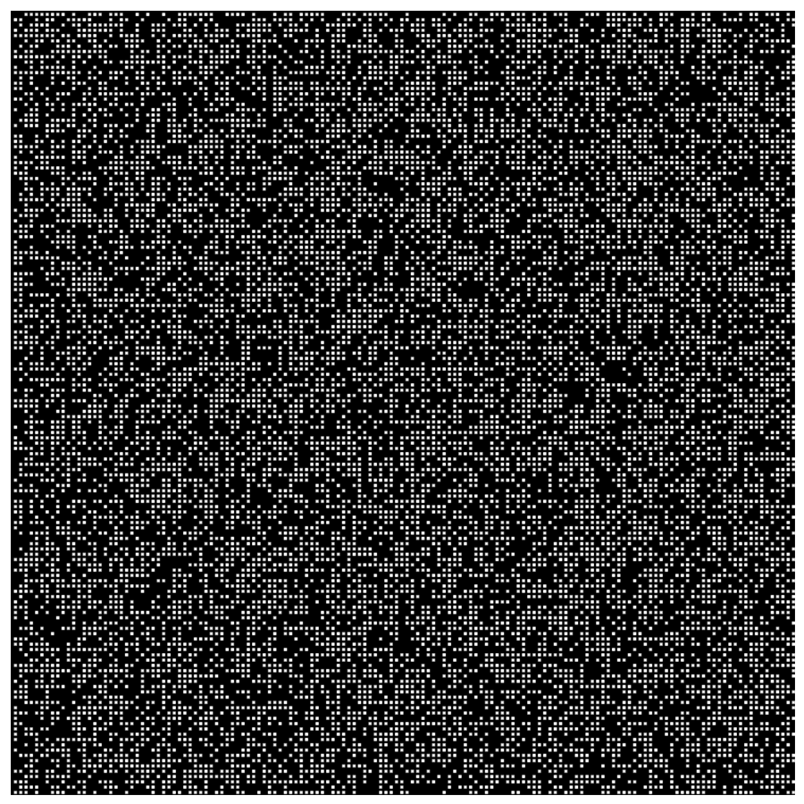
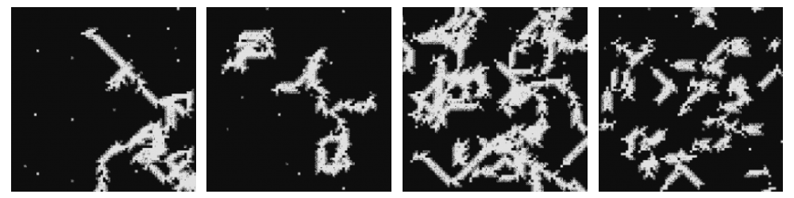

This is the first serious attempt to try to come with something on my own. The
idea came from the cover of a notebook[^1]. I was automatically attracted to it,
and I decided I wanted to replicate those graphics procedurally.

To set the title for this project, I used Eels' last album:
[The Deconstruction](https://www.youtube.com/watch?v=59Au8TUVakg)

At the end, I ended with results like these ones:

It took me about six hours along two days between drawing, designing, and
coding.

The code is available at
[davidomarf/generative/deconstruction](https://github.com/davidomarf/generative/tree/master/deconstruction).

## The abstraction

The first thing I did was de-composing the "pattern" into its individual
elements:

- **Points:** Pretty self-explanatory. At first, I assumed they were uniformly
  distributed, but after watching the notebook for a longer time, I realised
  that the individual points were only on the right-bottom `cell` inside a
  `slab`, which is a collection of 4 x 4 cells (more on this later). This makes
  the whole work appear more ordered.

- **Raindrops:** The diagonal lines with lengths between 3 and 6,

- **Chess slabs:** Slabs with a chess-like fill.

- **Solid slabs:** Slabs with a solid fill.

---

I noticed that the _individual points_ and the _raindrops_, were mostly
uniformly distributed. The slabs (_chess and solid_) can be in clusters or
uniform distribution.

## The Structure

The points are a filled `cell`, which is the basic structure. A cell can be
filled or blank.

A collection of (4 x 4) cells is a `slab`. And is the slab the structure that
can be solid (all cells filled), or chess-filled (filled and blank cells
intercalated).

## The "Randomness"

Apart from randomly deciding the position of each point/slab, I decided to
determine the "consistency" of each slab, by giving it some probability to
deviate from the ideal slab: filled cells when blanks are the default, or
viceversa.

---

Up to here, I coded the first versions. They lacked clusters, and were all
uniformly distributed accross the space.

{: .align-center} _The
bottom rows have more saturation of slabs. Left bottom didn't use solid-filled
slabs._

One of the results of this first version that I liked most, even being very
simple and basic, was this one using only points. I'll definetely modify this
(specially the opacity) for other projects.

{: .align-center}
_Generated using only points._

## The clustering

The clustering (I called it propagation during the design) was the last piece to
be developed. Even now I feel pretty unsure of the method I used, and I'm
looking forward to think of new methods that can get better results in term of
"naturality" and efficency.

My current idea goes like this:

1. Select one slab.
1. Choose the propagation direction.
1. Move to the next slab in that direction.
1. Grow to the sides (perpendicular direction from where you came)
1. Choose the propagation direction, which is **heavily influenced** by your
   previous direction.
1. Repeat 3-5 n times.

I chose to keep the direction somewhat constant because of the original looks of
the notebook.

After applying that idea, I could get clusters like this:

{: .align-center} _From
left to right: [3, 200|, [3, 80], [30, 30], [50, 8]. [n, max_length]_

[^fn1]: [The notebook at issue](https://laikanotebooks.com/product/laika-neo-grunge-d/)
