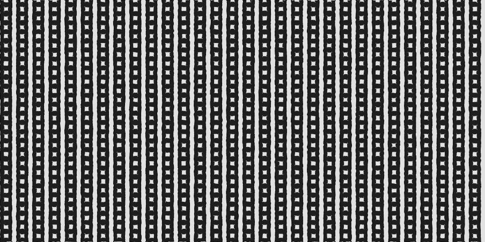
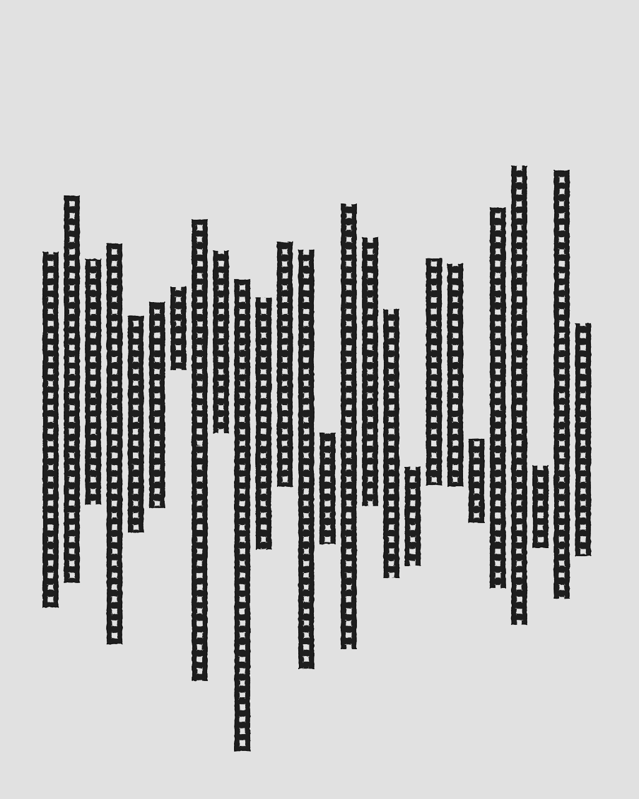
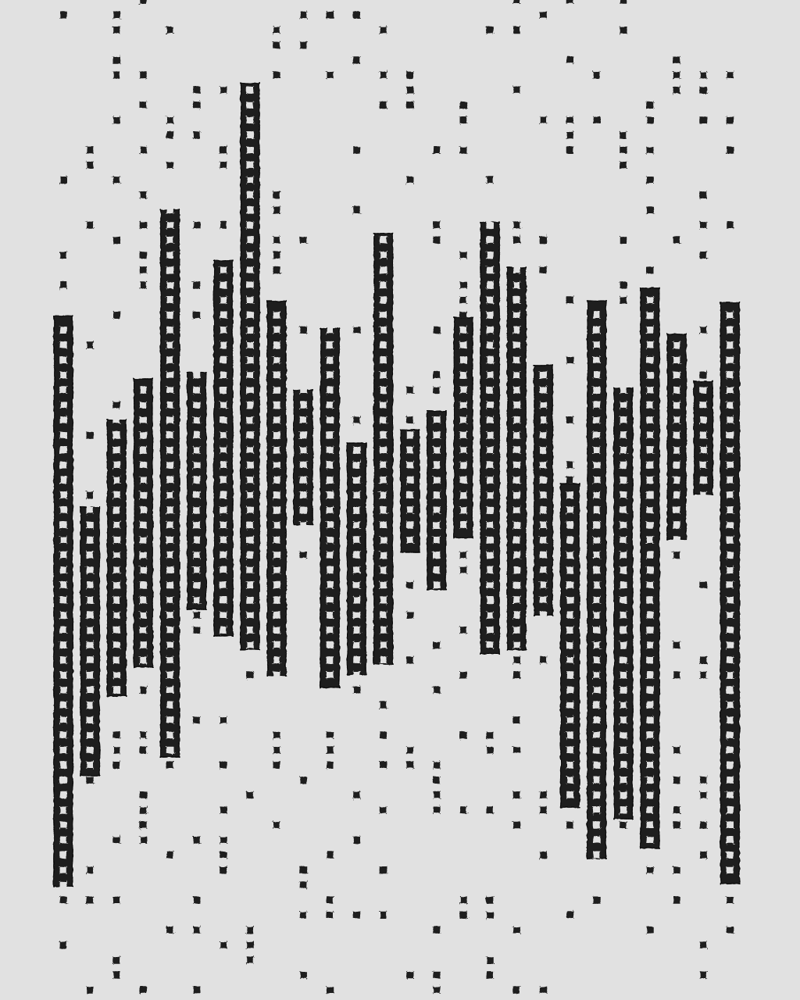
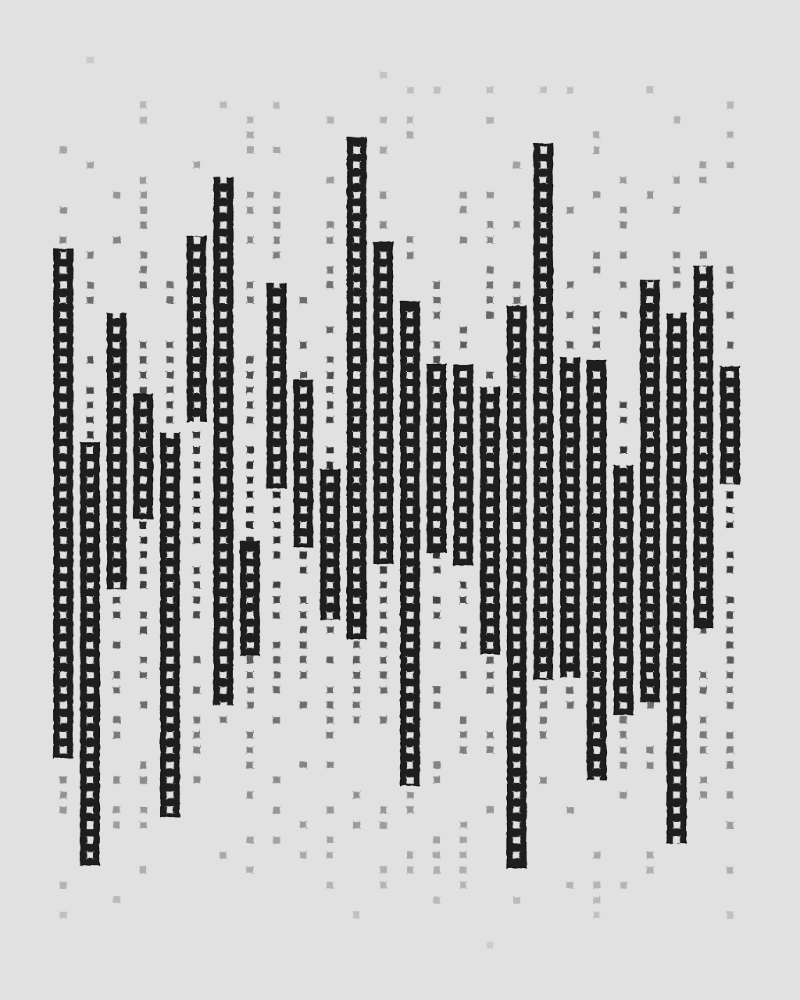
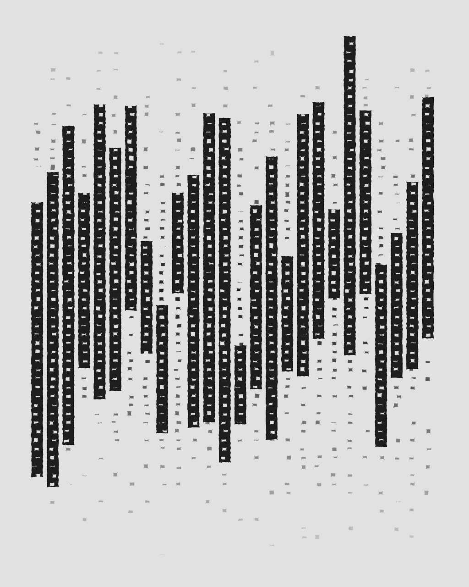
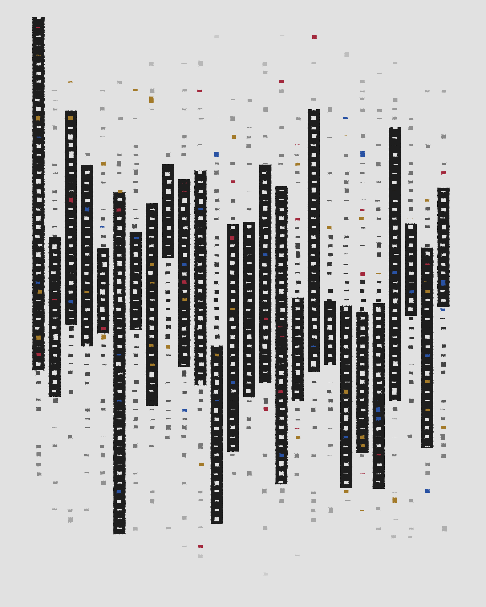
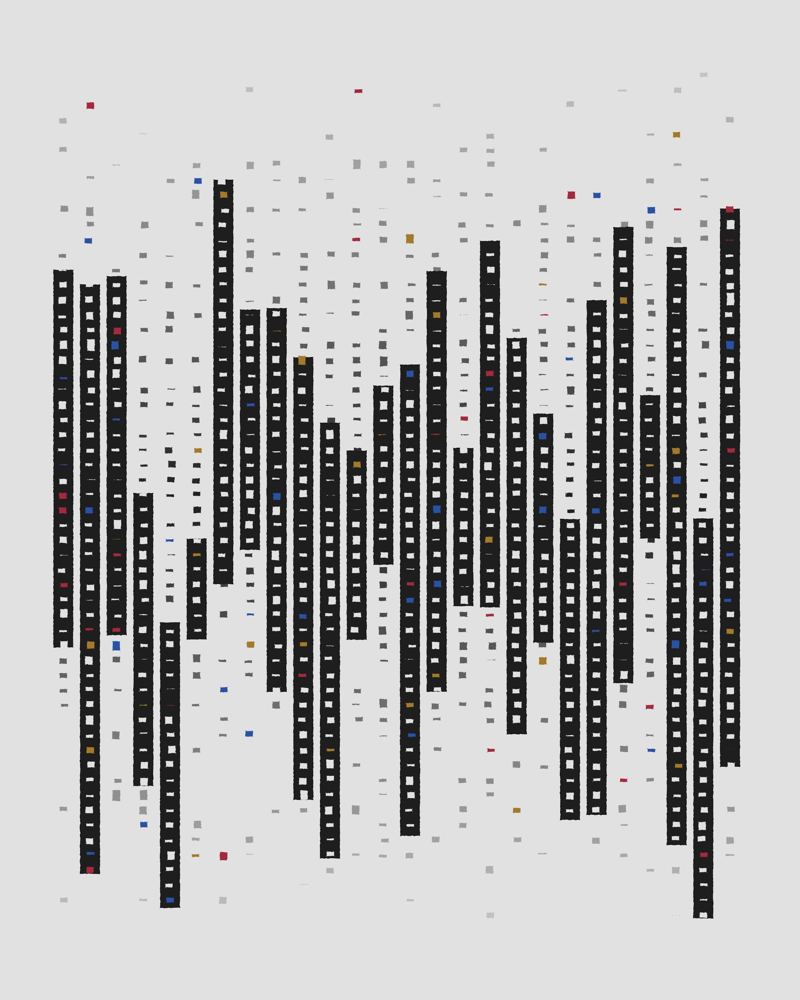
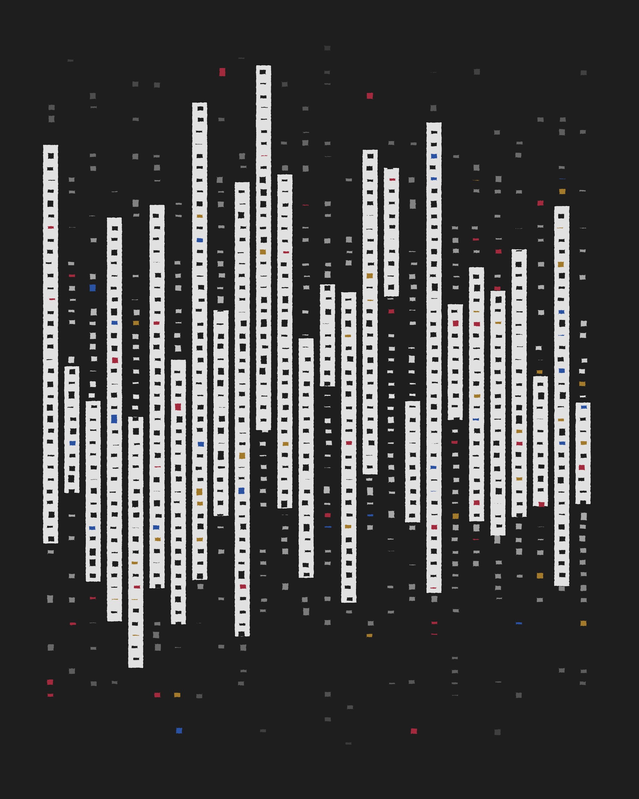
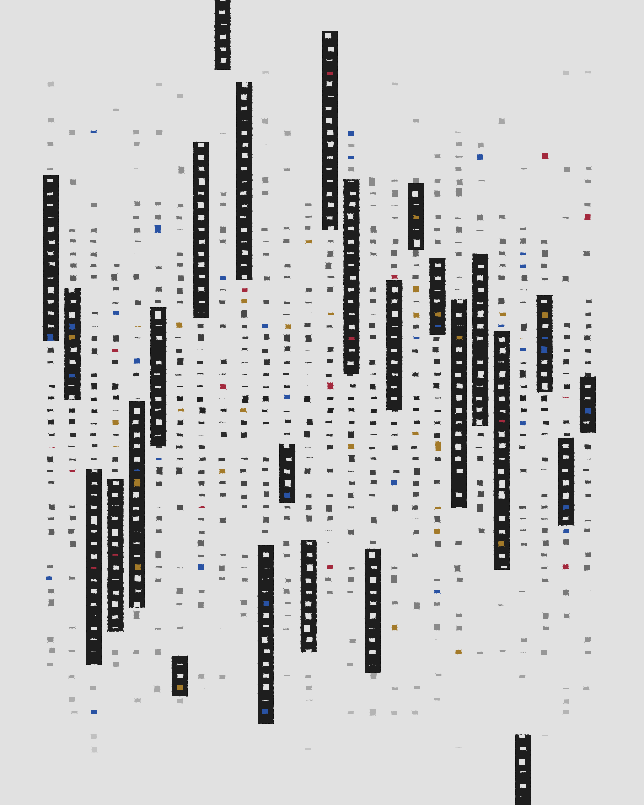

[Try the live version](https://play.generativemistakes.art/domino-dancing/)

## In a nutshell

1. Generate equally spaced black stripes with different height values, drawn
   with an offset from the vertical half.

- Create equally spaced squares along the vertical line `x = stripe.middle.x` of
  each stripe.
  - Use the probabilistic function `squareColor = f()` to determine the color of
    the square.
  - If the square is inside a black stripe, draw it.
  - If the square is outside a black stripe,
    - Use the probability `drawSquare = f(y)` that is lower the further away
      from `canvas.middle.y`, to determine if the square is drawn or not.
    - Draw it using an opacity value `alpha = f(y)` that is lower the further
      away from `canvas.middle.y`.

---

The original idea consisted on drawing the black stripes, full-height, from left
to right, filled with white squares with consistent spacing and size. Then it
would have big shapes over the resulting pattern, with a white filling and a
thick black border.

But as soon as I managed to generate the pattern, I started to experiment with
diverging ideas that I ended up loving.

As part of the original idea, I wanted to make all the traces in this work to
simulate shaky hand-drawing.

The method I produced, which I'll enhance and write about later, consists on
treating each line from `a` to `b` as a set of `n = distance(a, b)` points. Then
each point is deviated perpendicularly to the original line by some amount
produced with noise functions.

The first modification was from starting to treat the stripes as the main
subject of the work, instead of just a background pattern. To increase its
protagonism, I decided to randomize the height and vertical position of the
stripes.

This increased the whitespace at the top and the bottom. To compensate, I
decided not to draw the first and last two stripes, generating extra whitespace
at the sides of the work.

Although not completely necessary, this new separation between the background
and the work, made me want to try ways of integrating them. The thing that
ocurred to me was keeping to draw the squares outside the stripes, but with less
density.

This felt like a destruction of the original purpose: treating the stripes as
the main subject. To make the squares feel less strong, I changed the density
and the opacity using their `y` coordinate value. The further away from the
center, the less dense, and the less opaque.

Then, upon sharing the achieved look with a friend, he suggested that to
increase the "shaky-hand-drawn-style", I should also slightly randomize the size
and alignment of the little squares.

The final, optinal step, was adding some color, since, again, I felt that it was
the right move even if originally planned to be a black and white piece.

I just added a probability for any square (whether inside our outside a stripe,
and independent from its coordinates) to randomly choose between three available
colors.

## Final Works

---

This project is open source. If you want to experiment with it, you can
[get the code](https://github.com/davidomarf/generative-mistakes/tree/master/sketches/domino-dancing).

To generate different works with the same configuration of the final result, but
with different noise seeds,
[try the live version](https://play.generativemistakes.art/domino-dancing/)
