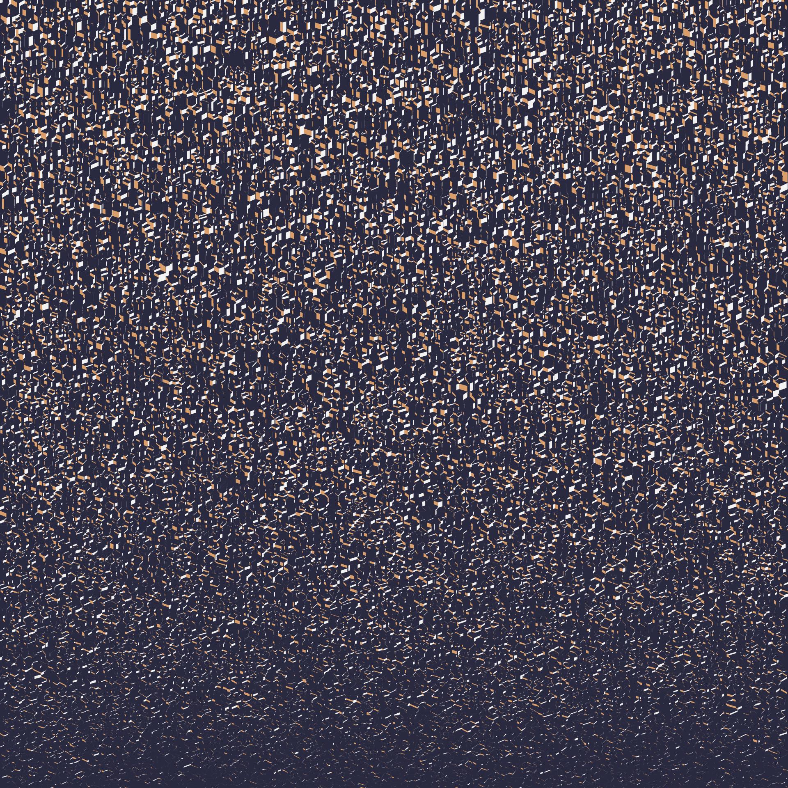

## In a nutshell

- Generate a uniformly distributed set of **n** points `(x, y)`
- Get the Voronoi diagram from the set of points.
- For each cell in the diagram:
  - Assign a height value `z = f(x, y)`
- Transform to simulate a 3D Visualization. Now each cell is a cell prism.
- Assign a color `c = f(θ)`to each cell prism face, where
  - `θ` is the angle of the prism face with respect to the X axis

---

