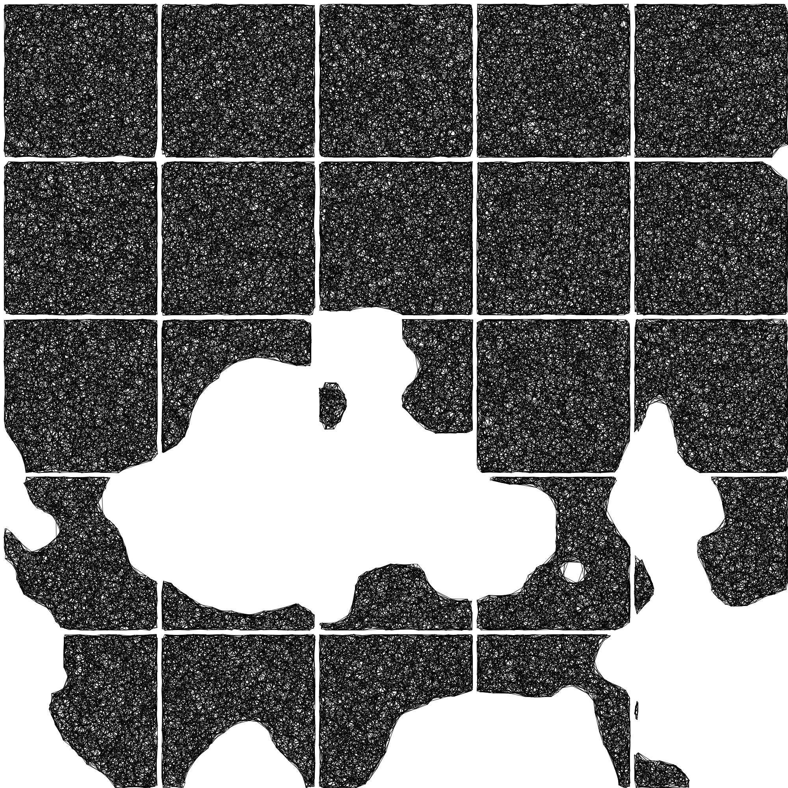
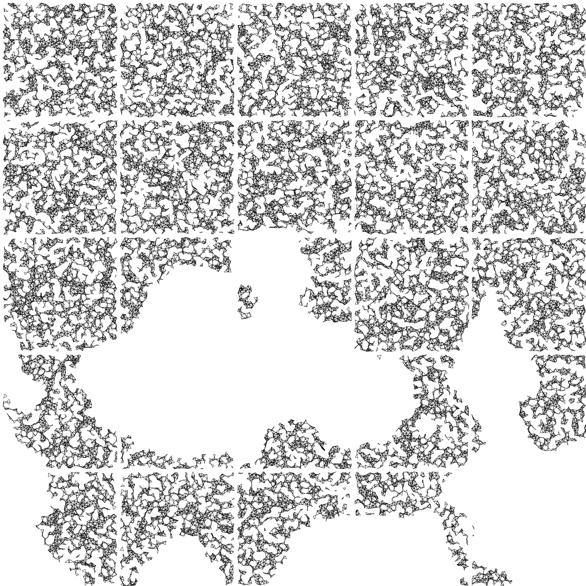
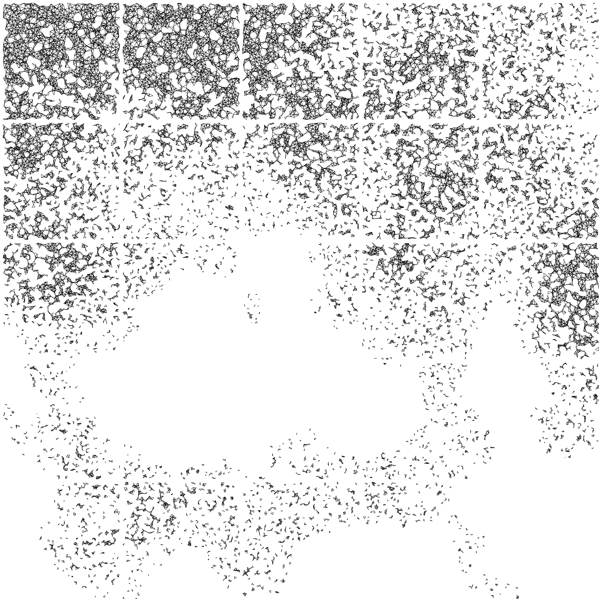
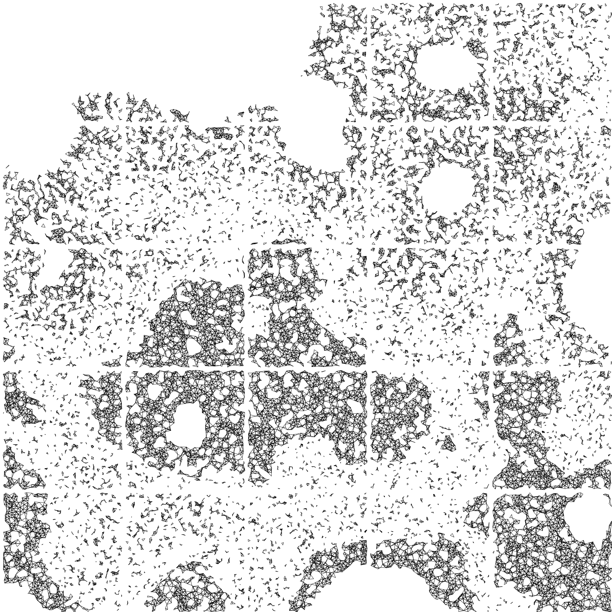
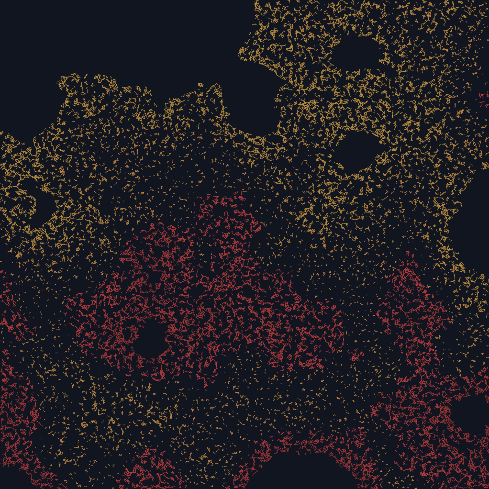
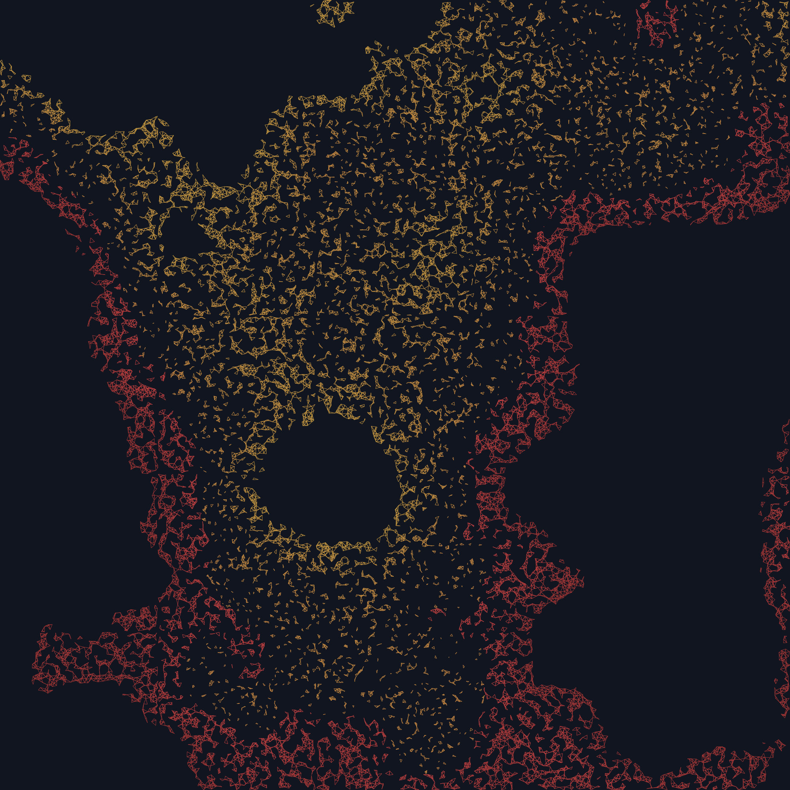
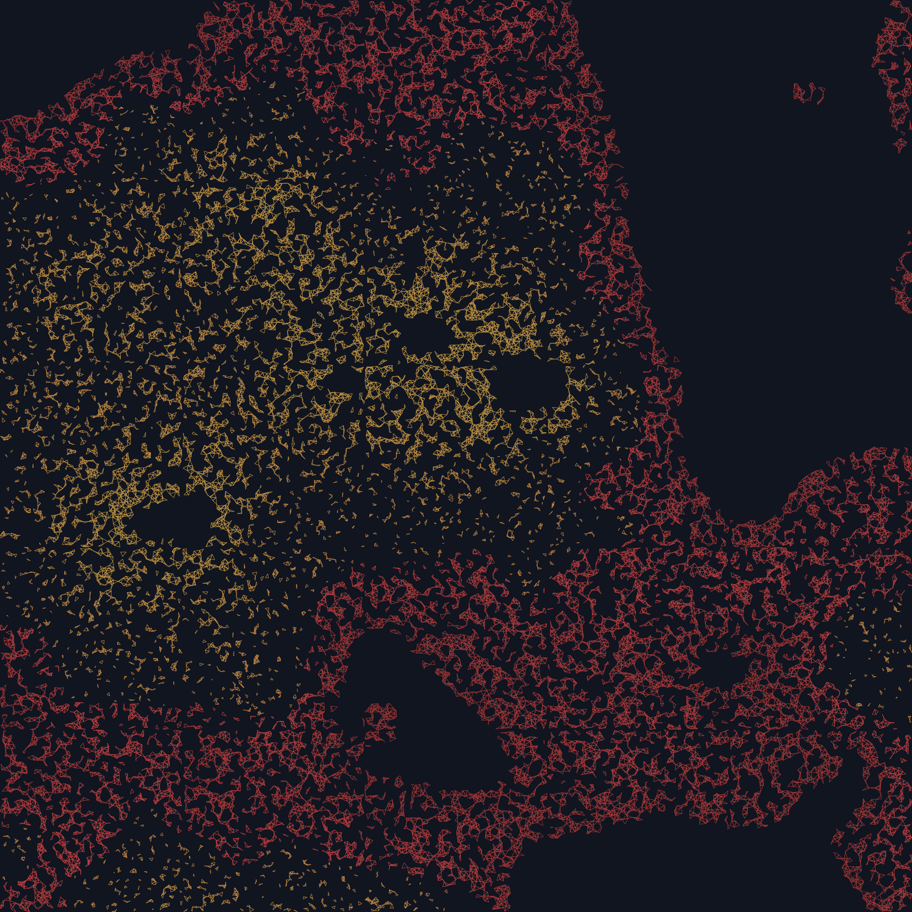

## In a nutshell

1. Generate a heightmap using noise functions with values between 0 and 1.

- Determine a height region between 0 and 1, e.g. (0.5, 0.7)
- Generate a uniformly distributed set of **n** points `(x, y)`.
- For every point in the set:
  - Get its corresponding height value `p.z` by mapping its coordinates to the
    heightmap.
  - If `p.z` is inside the height region, keep it. If not, discard it.
- Get the Delaunay triangulation from the final set.
- For every triangle in the Delaunay triangulation:
  - If one of the sides is bigger than `distance(p.z)`, don't draw it.
    - Else, draw the triangle with a color `color(p.z)`.
- Repeat with a different height region, and different functions for
  `distance(p.z)`, and `color(p.z)`.

---

Lately I've been working a lot with heights. It was one of the first things I
wanted to work with, but never did until recently. This project had a perfect
opportunity to use heightmaps in the process.

What I originally intended to do was a black and white piece that I could plot
in the future. I got the idea when I saw a piece in the Mexican Art Gallery. It
consisted of 9 squares, forming one big square. Each of the small squares was
filled with lines, one over the other, in different directions. At the center of
the piece, was the shape of the Mexico City completely blank, with no lines over
it.

My initial approach to do something like that, was to overlay multiple Delaunay
triangulations inside each square. Of course that would give me just an area
completely filled with lines. To create the sections, I decided to bring the
heightmaps in.

I'd generate one heigtmap, and the areas that had a corresponding height above a
certain threshold, would be blank. The areas below it, would be filled with the
mothod of the overlayed triangulations.

I implemented that, and added a restriction to draw the triangulation: If two
vertices of the triangle were too far apart (the distance between them was
greater than a drawing threshold `dt`), I wouldn't draw that triangle. This was
meant just to avoid lines crossing the blank area to join two very separate
points acros the figure.

The results looked like these:

That didn't look bad. Actually, I will work that idea further to still deliver a
black and white work.

However, I still decided to:

- Draw the triangulations only once. Not overlaying them.
- Decrement the drawing threshold `dt`. to allow triangles inside the black area
  to not be drawn.

This made the triangular shapes more visible. And allowed interesting patterns
to appear inside the filled areas.

And then I realized that I was using the heightmap just to differentiate between
black and white. I could use it to make the work more variated, so I defined
`f(p.z)` to return a different value for the drawing threshold `dt` for each
point, in function to its height.

And, if I could already define one area just by varying the drawing threshold
`dt`, I didn't need to leave the white area completely empty. I could fill it
with the same triangulation, but following using a different `f(p.z)` for the
drawing threshold `dt`.

But to keep increasing the interest in the shapes, I decided to restrict the
values that allowed the points to be pushed into the delaunay set. Instead of
just being above or below .5, they nedded to be also above .2, and below .7 (to
say some values).

Then, I decided that the black and white idea was no longer the best option,
since there was a lot of empty space, and decided to give some color to it.

Then I just kept playing with the functions to determine the drawing threshold,
and color.

## Final Works

Click on any image to open it in another tab at full resolution.

This project is open source. If you want to experiment with it, you can
[get the code](https://github.com/davidomarf/generative-mistakes/blob/master/sketches/trivoid/sketch.js).
